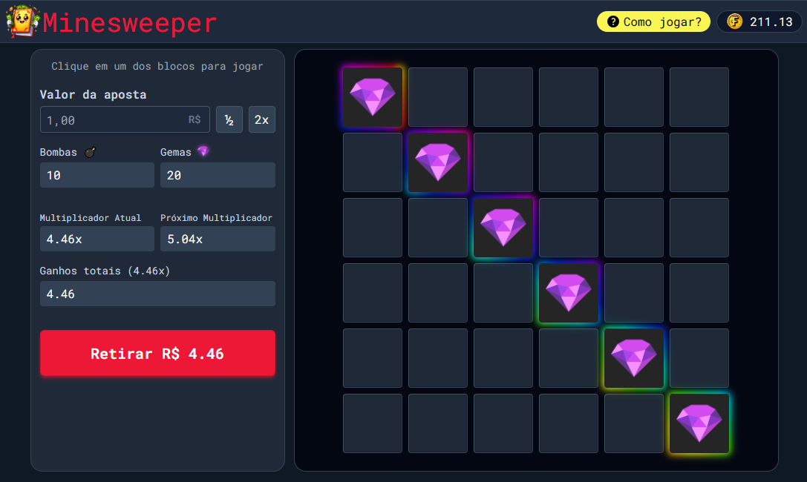
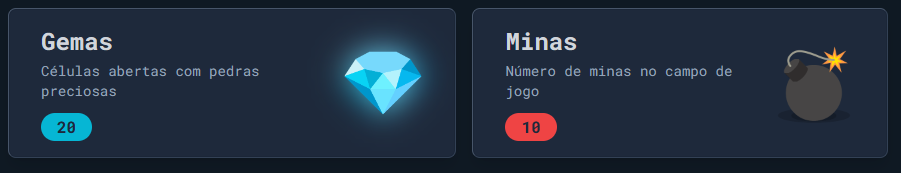
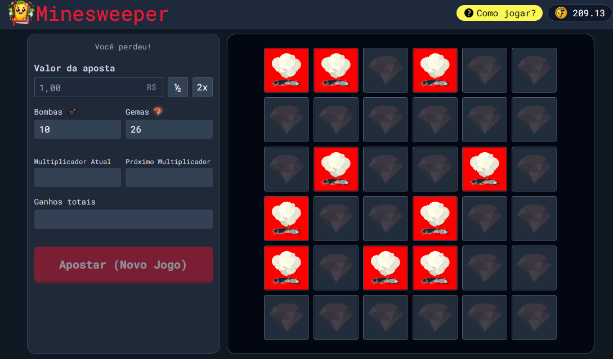

# MineSweeper Game (Campo Minado)

Ele é o clássico Jogo de Campo Minado , no qual as minas e as gemas ficam escondidas em uma grade de quadrados. Seu trabalho é acertar em qual bloco a gema está escondida e tomar cuidado para não clicar na mina e perder toda a aposta.

## Visão Geral

O jogo é formado por um tablado 6x6, com 36 opções de escolha (seis linhas e seis colunas). A cada rodada, o jogador deve definir um valor de entrada da aposta, e escolher um dos espaços (blocos) para descobrir o que está escondido. Abaixo de cada espaço, é possível encontrar dois símbolos, a gema ou bomba (ou mina).

A principal característica deste game é que se trata de um representante da categoria crash game, ou seja, daqueles em que é preciso sacar os seus ganhos antes que o pior aconteça. Mas neste jogo, o jogador tem mais tempo para decidir entre parar e continuar.

## Como Jogar

1. Acesse o jogo através deste [link](https://brendon3578.github.io/minesweeper-game-bet/src/index.html).
2. Faça sua aposta e clique no botão "Apostar (Novo Jogo)" para apostar.
3. Clique nos blocos que podem conter gemas ou minas
4. Retire a aposta quando achar necessário antes de clicar em uma mina

### Prós

Estas são as principais vantagens ao jogar o Mines jogo de aposta:

- Jogo personalizável – É possível configurar a quantidade de bombas distribuídas entre os 25 espaços. Quanto maior for a quantidade de bombas, maior será o valor do multiplicador informado acima;
- Lucro fixo – O jogador sempre fica sabendo qual será o valor do lucro se caso ele acertar a próxima estrela. Isso permite um controle melhor nas metas de ganhos;
- Tempo de Decisão – Ao contrário da maioria dos cresh games, esse não tem essa pressão de tomada rápida de decisão, a cada acerto, é possível parar para pensar o tempo que quiser.

Além disso, ainda existem as vantagens já citadas, que são as regras simples e os controles intuitivos.

### Contras

Não dá para esperar que um jogo vá agradar a todos os estilos de jogadores, e neste caso não poderia ser diferente. Chegou a hora de conhecer as desvantagens de jogar Mines:

- Gráficos simples – Por mais que o software tenha nascido para ser bem simples e básico, há quem reclame do visual mais "simplório" do jogo, que realmente lembra um videogame antigo.
- Baixos multiplicadores – Também tem gente que reclama que os multiplicadores são baixos, mas isso pode ser alterado através da quantidade de bombas e compensado por apostas maiores.

Vale lembrar, também, que a percepção pode mudar de jogador para jogador, mas já dá para ter uma noção do que esperar com estes prós e contras.

---

<h3 align="center">
    Feito com ☕ por <a href="https://github.com/Brendon3578"> Brendon Gomes</a>
</h3>
